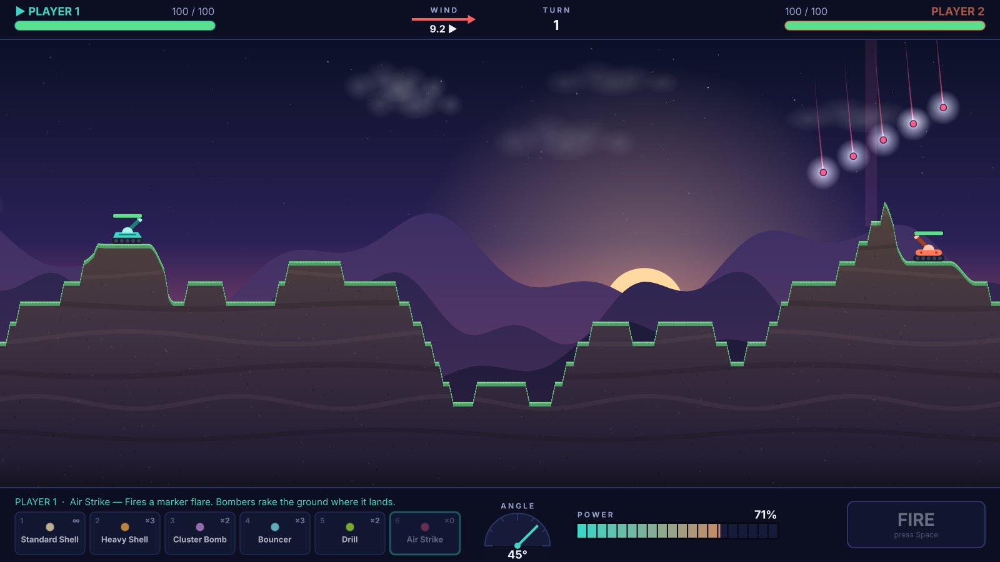

# Craterfall

An original, turn-based 2D artillery game for the browser. Two tanks, one keyboard, a destructible landscape and a wind that never stops changing. Built with **TypeScript**, **Phaser 3** and **Vite**, deployable to **GitHub Pages** with zero configuration.



> Craterfall is inspired by the classic artillery genre. All code, art, sounds, names and weapon designs are original; no assets from other games are used. Every texture is painted procedurally at runtime and every sound is synthesised with the Web Audio API.

---

## Contents

- [Features](#features)
- [Technology stack](#technology-stack)
- [Quick start](#quick-start)
- [Controls](#controls)
- [Architecture](#architecture)
- [How the projectile physics works](#how-the-projectile-physics-works)
- [Adding a new weapon](#adding-a-new-weapon)
- [Testing](#testing)
- [Production build](#production-build)
- [Deploying to GitHub Pages](#deploying-to-github-pages)
- [Future multiplayer architecture](#future-multiplayer-architecture)
- [License](#license)

## Features

- **Local two-player duels** on the same keyboard (hot-seat), with full mouse support.
- **Procedural, destructible terrain** — four layouts (rolling hills, valley, central summit, terraces), every explosion carves a crater, and tanks drop (and take fall damage) when the ground under them goes.
- **Deterministic physics** — our own fixed-timestep ballistic simulation with gravity and seeded wind; the same seeds and actions always replay identically.
- **Nine original weapons**, all data-driven:

  | # | Weapon | Behaviour |
  |---|--------|-----------|
  | 1 | Standard Shell | Balanced round, medium blast, unlimited |
  | 2 | Heavy Shell | Slower, much larger crater, high damage |
  | 3 | Cluster Bomb | Splits into a fan of five bomblets at the top of its arc |
  | 4 | Bouncer | Ricochets off the first surface, detonates on the next |
  | 5 | Drill | Bores through up to 90 units of ground before exploding |
  | 6 | Air Strike | A marker flare calls in a staggered line of bombs |
  | 7 | Magma Pool | Leaves a pool of molten rock that burns any tank in it at the end of every turn |
  | 8 | Dirt Creator | Drops a pyramid of earth where it lands — build walls or lift a rival into the open |
  | 9 | Dirt Remover | Scoops out a huge bowl of earth with no blast damage; tanks still fall |

- **Explosions with falloff damage**, particles, shockwaves, debris, and screen shake for big blasts (can be turned off).
- **Polished HUD** outside the playfield: health bars, wind gauge, turn counter, weapon cards with ammo, angle protractor, segmented power meter and FIRE button.
- **Menus**: Play Local, Settings (master / effects / music volume, screen shake, aim guide) and How to Play. Settings persist in `localStorage`.
- **Procedural audio**: synthesised sound effects and an ambient generative music pad behind a swappable `AudioManager`.
- **Responsive**: a fixed 1600×900 logical canvas scaled to fit any window; tested at 1280×720, 1366×768 and 1920×1080. Works with WebGL and falls back to Canvas.

## Technology stack

| Tool | Purpose |
|------|---------|
| [TypeScript](https://www.typescriptlang.org/) (strict) | Language |
| [Phaser 3](https://phaser.io/) | Rendering, input, tweens, particles, scenes |
| [Vite](https://vitejs.dev/) | Dev server and production bundler |
| [Vitest](https://vitest.dev/) | Unit tests for the deterministic engine |
| GitHub Actions + GitHub Pages | CI and hosting |

No React, no Phaser physics plugins, no external assets.

## Quick start

Requires **Node.js 18.18+** (Node 22 recommended — see `.nvmrc`).

```bash
npm install
npm run dev
```

Open the URL Vite prints (usually <http://localhost:5173>).

| Script | What it does |
|--------|--------------|
| `npm run dev` | Start the dev server with hot reload |
| `npm run build` | Type-check, then build to `dist/` |
| `npm run preview` | Serve the production build locally |
| `npm test` | Run the unit tests once |
| `npm run test:watch` | Run tests in watch mode |
| `npm run typecheck` | Type-check only |

After your first `npm install`, commit the generated `package-lock.json` so CI installs are reproducible (the workflows use `npm ci` when a lockfile exists).

## Controls

All bindings live in one file: [`src/game/config/controls.ts`](src/game/config/controls.ts).

| Action | Player 1 | Player 2 | Mouse |
|--------|----------|----------|-------|
| Rotate barrel left / right | `A` / `D` | `←` / `→` | Drag in the battlefield, or on the angle dial |
| Power up / down | `W` / `S` | `↑` / `↓` | Drag distance from your tank, mouse wheel, or the power bar |
| Fire | `Space` | `Enter` | FIRE button |
| Select weapon | `1`–`6` | `1`–`6` | Click a weapon card |
| Previous / next weapon | `Q` / `E` | `Q` / `E` | — |
| Fine adjustment | hold `Shift` | hold `Shift` | — |
| Pause | `Esc` | `Esc` | — |

Angles follow the usual maths convention: **0° points right, 90° straight up, 180° left**. Only the active player's keys do anything, and all input is locked while projectiles are in the air.

## Architecture

The code is split into a **pure, deterministic engine** that knows nothing about Phaser, and a **presentation layer** (scenes, renderers, HUD, audio) that reads engine state and reacts to engine events.

```
src/
├── main.ts                     Entry point
├── styles.css
├── types/
│   ├── game.ts                 GameState, PlayerAction, SimEvent, phases …
│   └── weapons.ts              WeaponDefinition + behaviour config union
├── utils/
│   ├── math.ts
│   └── random.ts               Seeded PRNG (mulberry32)
├── game/
│   ├── Game.ts                 Creates Phaser.Game and shared services
│   ├── GameConfig.ts           Phaser config (scale mode, scenes)
│   ├── services.ts             Settings + audio handed to scenes explicitly
│   ├── config/                 ← every tunable value lives here
│   │   ├── gameBalance.ts      Physics, wind, damage, terrain, timing
│   │   ├── weapons.ts          The weapon roster (pure data)
│   │   ├── controls.ts         Key bindings + mouse tuning
│   │   ├── layout.ts           16:9 logical layout, HUD bar sizes
│   │   └── theme.ts            Colours and fonts
│   ├── entities/               Plain data + small helpers (no Phaser)
│   │   ├── Terrain.ts          Height map, carving, normals
│   │   ├── TerrainGenerator.ts Seeded procedural layouts
│   │   ├── Tank.ts  Player.ts  Projectile.ts  Explosion.ts
│   ├── physics/                (no Phaser)
│   │   ├── ProjectilePhysics.ts  Launch velocity + fixed-step integrator
│   │   ├── CollisionSystem.ts    Out-of-bounds / tank / terrain checks
│   │   └── TerrainCollision.ts   Surface lift + reflection
│   ├── systems/                (no Phaser)
│   │   ├── MatchEngine.ts      The authoritative simulation
│   │   ├── TurnManager.ts      Phase machine + turn order
│   │   ├── ProjectileSystem.ts Steps projectiles, applies behaviours
│   │   ├── ExplosionSystem.ts  Crater + damage + tank settling
│   │   ├── DamageSystem.ts     Falloff and fall damage
│   │   ├── HazardSystem.ts     Magma pools that burn at the end of each turn
│   │   ├── WindSystem.ts       Seeded wind sequence
│   │   └── GameState.ts        State construction, winner detection, cloning
│   ├── weapons/
│   │   ├── Weapon.ts           Weapon + ProjectileBehavior interfaces
│   │   ├── WeaponManager.ts    Roster, validation, lookup
│   │   └── weapons/            One file per behaviour + registry
│   ├── input/InputManager.ts   Keyboard/mouse → intents
│   ├── audio/                  AudioManager, Web Audio synth, event→sound map
│   ├── persistence/            SettingsStore (localStorage, validated)
│   ├── rendering/              Terrain, background, tanks, projectiles, effects
│   └── scenes/                 Boot, Menu, Settings, HowToPlay, Game, GameOver
└── ui/                         HUD widgets: HealthPanel, WindIndicator,
                                WeaponSelector, AngleIndicator, PowerMeter, Button …
tests/                          Vitest suites for the engine (no rendering)
```

### Data flow

```
 keyboard / mouse ──► InputManager ──► GameScene ──► PlayerAction ──► MatchEngine.submitAction()
                                                                         │
                                            fixed-step MatchEngine.tick() ◄─┘   (as often as real time requires)
                                                                         │
                                                       SimEvent stream ──┴──► WorldView (renderers)
                                                                         ├──► HUD
                                                                         └──► GameAudio → AudioManager
```

- **`MatchEngine`** owns the `GameStateData`, the `Terrain` and all projectiles. It accepts only `PlayerAction` commands and advances only in fixed steps. Everything it does is announced as a `SimEvent` (`shotFired`, `explosion`, `terrainChanged`, `tankDamaged`, `turnStarted`, `gameOver`, …).
- **`TurnManager`** is the single owner of the phase machine — `AIMING → PROJECTILE_FLYING → EXPLOSION → TURN_END → AIMING` (or `GAME_OVER`). There are no scattered booleans; illegal transitions throw.
- **Rendering is a pure consumer.** `WorldView` mirrors projectile positions each frame and turns events into visuals; `TerrainRenderer` redraws only the dirty column range after a crater.
- **Audio never touches gameplay.** `GameAudio.ts` maps events to sound IDs; `AudioManager` applies volumes and forwards to a `SoundBackend` (the default `SynthBackend` generates every sound; a sample-based backend can replace it without changing any other file).
- **Services are explicit.** `SettingsStore` and `AudioManager` are created once in `Game.ts` and handed to scenes via the Phaser registry (`getServices(scene)`), not stored in module-level globals.

### Terrain

Terrain is a height map: a `Float32Array` with one surface Y value per world column. It is generated from four seeded sine octaves, shaped by one of four layouts, smoothed, clamped and given a flat pad under each tank. Carving a crater lowers each affected column to the bottom of the blast circle (O(radius)), never below a thin bedrock strip. A height map cannot represent caves, so ground above an underground blast collapses — which suits artillery gameplay.

## How the projectile physics works

All trajectory maths is ours (`src/game/physics/ProjectilePhysics.ts`); Phaser's physics engines are not used. World units have **+x right and +y down**.

**Launch.** With angle θ (degrees, 0° = right, 90° = up), power *p* % and the weapon's `projectileSpeed` *S*:

```
speed = S · p / 100
vx    =  speed · cos θ
vy    = −speed · sin θ      (negative because +y points down on screen)
```

The projectile starts at the barrel tip.

**Integration.** Every fixed step `dt` (default 1/120 s) uses semi-implicit Euler:

```
vx += windAcceleration · dt
vy += gravity          · dt
x  += vx · dt
y  += vy · dt
```

Updating velocity before position keeps trajectories stable; using a fixed `dt` (independent of frame rate) makes them deterministic. `GameScene` runs as many steps per frame as real time requires, capped by `PHYSICS.maxStepsPerFrame`.

**Wind.** Each turn a seeded `WindSystem` rolls `{ direction: −1 | 1, strength: 0…10 }`. Its acceleration is `direction × strength × PHYSICS.windInfluence` and acts on every projectile for its whole flight (cluster fragments and air-strike bombs included).

**Collisions** (per step, in priority order): leaving the sides or bottom of the world (the sky is open — shells may arc above the screen), touching a tank's hit circle (the firing tank is ignored for a short arming time), or entering solid ground. The projectile's behaviour decides what happens next.

**Damage falloff.** For a blast of radius *r* and damage *D*, a tank whose hull is at distance *d* from the centre takes

```
d ≤ r :  D · (1 − d / r) ^ falloffExponent      (falloffExponent = 1 → linear)
d > r :  0
```

Nothing outside the radius is ever damaged. Tanks whose ground is blasted away drop onto the new surface and take fall damage beyond a threshold.

Every constant — gravity, wind influence, timestep, falloff exponent, fall damage, terrain shape, effect thresholds — lives in [`src/game/config/gameBalance.ts`](src/game/config/gameBalance.ts).

## Adding a new weapon

Weapons are pure data in [`src/game/config/weapons.ts`](src/game/config/weapons.ts). The weapon selector, number-key shortcuts, ammo tracking, How to Play screen and validation all pick new entries up automatically.

### Option A — reuse an existing behaviour (data only)

Append an entry; for example, a long-range sniper round:

```ts
{
  id: 'needle',
  name: 'Needle',
  description: 'Very fast, tiny blast. Rewards precise aim.',
  projectileSpeed: 1150,
  explosionRadius: 22,
  damage: 40,
  ammo: 2,
  projectileRadius: 3,
  color: 0xe0e7ff,
  behavior: { kind: 'impact' },
},
```

Available behaviour kinds: `impact`, `cluster`, `bounce`, `drill`, `airstrike` — each with its own parameters (see `src/types/weapons.ts`). A three-bounce cluster? A heavier, wider air strike? All just data.

Any warhead can also set these optional fields, which is how Magma Pool, Dirt Creator and Dirt Remover are built:

| Field | Values | Effect |
|-------|--------|--------|
| `terrain` | `{ kind: 'carve' }` (default) · `{ kind: 'pyramid', height, halfWidth }` · `{ kind: 'none' }` | Dig a crater, drop a pyramid of earth, or leave the ground alone |
| `visual` | `'fire'` (default) · `'dust'` · `'magma'` | How the detonation looks and sounds (cosmetic only) |
| `hazard` | `{ kind: 'magma', radius, damagePerTurn, turns }` | Leave a pool that burns tanks standing in it at the end of each turn |

For example, a wider, lower mound is just `terrain: { kind: 'pyramid', height: 60, halfWidth: 140 }`.

### Option B — a brand-new behaviour

1. **Describe its config** — add an interface to the `BehaviorConfig` union in `src/types/weapons.ts`:

   ```ts
   export interface SplitterBehaviorConfig { kind: 'splitter'; parts: number; }
   ```

2. **Implement the hooks** in `src/game/weapons/weapons/SplitterBehavior.ts`. A behaviour may implement `afterStep` (runs every step), `onTerrainContact` (runs every step the projectile is inside ground) and `onTankContact`. Each returns `continue`, `explode` or `remove`, optionally with child `spawns`:

   ```ts
   export const SplitterBehavior: ProjectileBehavior<SplitterBehaviorConfig> = {
     kind: 'splitter',
     onTerrainContact: (p, config) => ({
       action: 'explode',
       spawns: makeChildren(p, config.parts),
     }),
   };
   ```

3. **Register it** in `src/game/weapons/weapons/index.ts`. The registry is a mapped type, so the compiler refuses to build until every kind in the union has an implementation.

4. **Add weapons** that use it in `config/weapons.ts`.

The engine (`ProjectileSystem`, `MatchEngine`) never changes. Behaviours must stay deterministic: no `Math.random()`, no wall-clock time.

## Testing

```bash
npm test
```

The Vitest suites under `tests/` exercise only the engine — no rendering, no DOM:

| Suite | Covers |
|-------|--------|
| `projectilePhysics.test.ts` | Launch vectors, integrator vs. analytic parabola, wind drift, determinism |
| `wind.test.ts` | Seeded sequences, bounds, precision, acceleration |
| `damage.test.ts` | Linear falloff, radius cut-off, hull distance, fall damage |
| `terrain.test.ts` | Solidity, interpolation, crater carving, bedrock, generation, collisions, reflection |
| `turnManager.test.ts` | Phase transitions, player switching, input locking, action validation |
| `weapons.test.ts` | Config validation, data-only weapons, ammo, every behaviour |
| `terrainWeapons.test.ts` | Pyramid building, Dirt Remover falls, magma pools burning, expiring and ending a match |
| `gameOver.test.ts` | Winner / draw detection, end-of-match flow |
| `determinism.test.ts` | Full scripted matches replay bit-for-bit from seeds + actions |
| `settings.test.ts` | localStorage persistence, corrupt data recovery |

## Production build

```bash
npm run build      # type-check + bundle into dist/
npm run preview    # serve dist/ locally
```

Phaser is emitted as its own chunk so it stays cached between releases. Set `BASE_PATH` when the site is not served from the domain root:

```bash
BASE_PATH=/craterfall/ npm run build
```

## Deploying to GitHub Pages

The repository includes [`.github/workflows/deploy.yml`](.github/workflows/deploy.yml), which on every push to `main`:

1. checks out the repository,
2. installs dependencies (`npm ci` if a lockfile exists),
3. runs the test suite,
4. builds with `BASE_PATH=/<repository-name>/` (or `/` for a `<user>.github.io` repository),
5. uploads `dist/` and deploys it with the official Pages actions.

One-time setup:

1. Push the project to a GitHub repository (default branch `main`).
2. In **Settings → Pages**, set **Source** to **GitHub Actions**.
3. Push to `main` (or run the workflow manually from the **Actions** tab).

The game will be live at `https://<github-username>.github.io/<repository-name>/`.

A second workflow, `ci.yml`, type-checks, tests and builds every pull request.

## Future multiplayer architecture

Online play is not implemented yet, but the engine was designed for it:

- **Commands, not input.** The only way to change a match is `MatchEngine.submitAction(action)`, where

  ```ts
  interface PlayerAction { playerId; turnNumber; weaponId; angle; power }
  ```

  Actions are validated (turn order, stale turn numbers, ammo, ranges) and rejected without side effects.
- **Determinism.** Terrain, tank placement and wind come from seeds; physics uses a fixed timestep; behaviours are random-free. `MatchEngine.replay(config, actions)` reproduces any match exactly, and a test enforces it.
- **No Phaser in the engine.** `src/game/{entities,physics,systems,weapons}` and `src/types` import nothing from Phaser or the DOM, so they run unchanged in Node.

A WebSocket version would look like this:

```
 Client A ──PlayerAction──►  Node.js server (authoritative)  ◄──PlayerAction── Client B
                             • owns the MatchEngine + seeds
                             • validates action, runUntilIdle()
                             • broadcasts the accepted action
                               (and optionally a state hash)
 Client A ◄──────────────────────────────┴─────────────────────────────────► Client B
   both replay the accepted action locally with the same engine → identical results
```

Because clients only need the seeds and the accepted action log, bandwidth is tiny; a state hash (e.g. of `cloneGameState(engine.state)` plus the terrain snapshot) lets the server detect desyncs. Reconnecting players simply replay the log.

## License

[MIT](LICENSE). Craterfall's code, procedural art and synthesised audio are original works.
